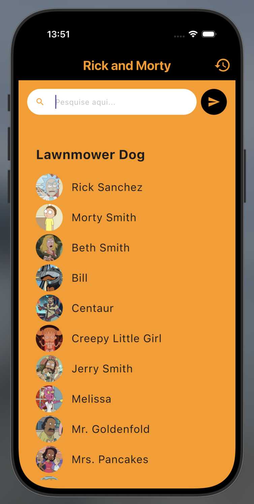
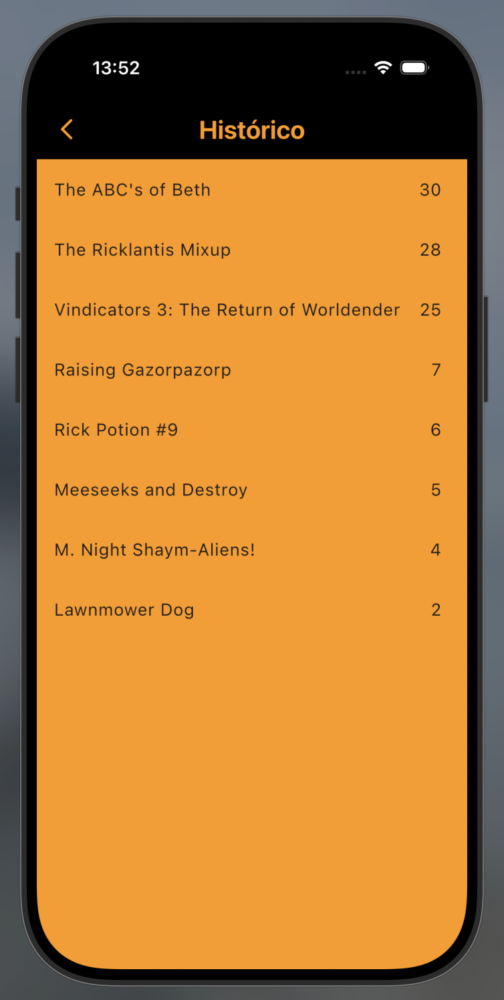
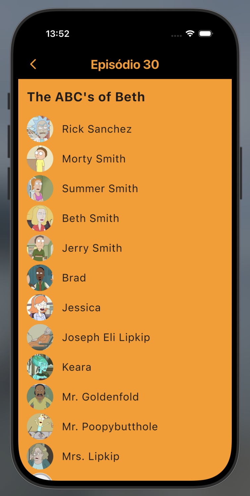

# Teste ZRP

Um projeto desenvolvido com Flutter utilizando:

- Clean Architecture
- Persistência em banco local
- Bloc/Cubit
- GetIt
- GoRouter
- Sqflite
- Skeleton Loading
- Testes unitários

O app permite:

- buscar episódios através do endpoint:
  https://rickandmortyapi.com/api/episode/{id}

- apresentar uma lista de personagens do episódio através do endpoint:
  https://rickandmortyapi.com/api/character/{id}

- persistir os dados localmente com SQLite

- consultar histórico offline

---

# Evidências da aplicação

## Screenshots

